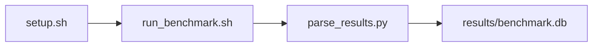

# iPerf3 TCP/UDP Sweep Benchmark

[](LICENSE)
[](https://github.com/garys-gpu-benchmarks/408-sys-bench-nvidia-iperf3-network-performance-ubu2604/actions/workflows/ci.yml)

Target: Ubuntu 26.04 · NVIDIA · see Hardware Requirements. This is a host benchmark, not a laptop `pip install` project.

## Quick Start

```bash
git clone https://github.com/garys-gpu-benchmarks/408-sys-bench-nvidia-iperf3-network-performance-ubu2604.git
cd 408-sys-bench-nvidia-iperf3-network-performance-ubu2604
sudo bash setup.sh --assume-yes
bash run_benchmark.sh --profile smoke --validate
```
Results are written to `results/benchmark.db` and `results/summary.json`.

This workload is executed on the validation host after the repository is copied there. `setup.sh` and `run_benchmark.sh` do not open an outbound SSH session.

Prerequisites: Ubuntu 26.04; NVIDIA; Python 3.14.4; root or sudo for `setup.sh`. Framework: Bash, SQLite, Python, PyYAML, iPerf3. This is a host benchmark, not a laptop `pip install` project.



## 1. Overview

Runs iperf3 -J client tests for each yaml protocol. Default peer is 127.0.0.1 (loopback); override with BENCHMARK_IPERF_PEER. protocol: tcp and/or udp. parallel_streams: -P. Sweep dimensions: protocol, port, reverse_mode, window_size, buffer_length, parallel_streams, bandwidth_limit, omit_initial_seconds.

## 2. What It Validates

- Validates that each protocol JSON run completes. Default path is loopback, not VM-to-VM, unless BENCHMARK_IPERF_PEER is set
- #1: TCP loopback throughput (tcp_loopback_gbps); is present and physically sensible.
- #2: UDP loopback throughput (udp_throughput_gbps); is present and physically sensible.
- #3: UDP jitter (udp_jitter_ms); is present and physically sensible.
- #4: Packet loss, percent (packet_loss_rate); is present and physically sensible.
- #5: TCP retransmit count per run (tcp_retransmit_count) is present and physically sensible.

## 3. Metrics Captured

- **#1: TCP loopback throughput** — stored as `tcp_loopback_gbps`.
- **#2: UDP loopback throughput** — stored as `udp_throughput_gbps`.
- **#3: UDP jitter** — stored as `udp_jitter_ms`.
- **#4: Packet loss, percent** — stored as `packet_loss_rate`.
- **#5: TCP retransmit count per run** — stored as `tcp_retransmit_count`.

## 4. Hardware Requirements

### Supported environment

- OS: Ubuntu 26.04
- GPU vendor: NVIDIA
- Framework family: Bash, SQLite, Python, PyYAML, iPerf3
- Python: Python 3.14.4

### Reference validation environment

The tables below describe the machine used to generate the reference results. They are not a requirement that every user buy that exact cloud instance.

### System

Runs iperf3 -J client tests for each yaml protocol. Default peer is 127.0.0.1 (loopback); override with BENCHMARK_IPERF_PEER. protocol: tcp and/or udp.

### GPU

Ubuntu 26.04 / NVIDIA / Bash, SQLite, Python, PyYAML, iPerf3

## 5. Software Requirements

| Component | Version |
|---|---|
| OS | Ubuntu 26.04 |
| Kernel | kernel 7.0.0 |
| Python | Python 3.14.4 |
| ROCm | CUDA 13.3 |
| rocBLAS | N/A - rocBLAS not used |

Runs iperf3 -J client tests for each yaml protocol. Default peer is 127.0.0.1 (loopback); override with BENCHMARK_IPERF_PEER. protocol: tcp and/or udp.

## 6. Installation

```bash
Run iperf3 client (-J) and, for loopback, iperf3 -s -1
```

## 7. Running the Benchmark

```bash
Run iperf3 client (-J) and, for loopback, iperf3 -s -1
```

**Validating results separately:**

```bash
export BENCHMARK_PYTHON=/usr/bin/python3.13  # optional
python3 -m venv .venv
source ".venv/bin/activate"
".venv/bin/python" scripts/validate_results.py
```

## 8. Output

### `results/benchmark.db` (SQLite)

iperf3 -J JSON plus one normalized CSV row per protocol. The endpoint column records 127.0.0.1 unless BENCHMARK_IPERF_PEER is set

sample_index,status,protocol,iperf_endpoint,parallel_streams,tcp_loopback_gbps,udp_throughput_gbps,udp_jitter_ms,packet_loss_rate,tcp_retransmit_count,bits_per_second,error_message
0,ok,tcp,127.0.0.1,1,40,,,,,40000000000,

```bash
Run iperf3 client (-J) and, for loopback, iperf3 -s -1
```

### `results/summary.json`

Consolidated metrics from the most recent run — suitable for CI artifact upload or dashboard ingestion.

### `results/raw/<timestamp>.txt`

iperf3 -J JSON plus one normalized CSV row per protocol. The endpoint column records 127.0.0.1 unless BENCHMARK_IPERF_PEER is set

sample_index,status,protocol,iperf_endpoint,parallel_streams,tcp_loopback_gbps,udp_throughput_gbps,udp_jitter_ms,packet_loss_rate,tcp_retransmit_count,bits_per_second,error_message
0,ok,tcp,127.0.0.1,1,40,,,,,40000000000,

## 9. Baselines / Thresholds

Expected ranges and gates live in `config/benchmark_config.yaml` under `baselines:` or `thresholds:`. To update them, edit that file — never edit validation code directly.

## 10. Troubleshooting

**`setup.sh` missing collector**
Create cannot finish without `scripts/collect_workload.py`.

**`self_check` overlay rewritten**
Do not overwrite files listed in `results/overlay_lock.json`.

**Remote SSH drop during setup**
Reconnect and resume `bash setup.sh --assume-yes`. Do not wipe `.venv` or `.cache`.

## 11. NVIDIA H100 Coding Differences

Native NVIDIA CUDA workload. Execute on the stated Ubuntu release with the host NVIDIA driver and CUDA userspace. ROCm porting notes do not apply.

## Repository layout

```text
.
├── setup.sh
├── run_benchmark.sh
├── benchmark_specification.json
├── .github/workflows/      # thin CI callers (see Continuous Integration)
├── config/
├── scripts/
├── src/
├── tests/
├── docs/
├── results/
└── LICENSE
```

## Continuous Integration

| Workflow | Runs on | When | What it does |
|---|---|---|---|
| [CI](.github/workflows/ci.yml) | GitHub-hosted runner | every pull request, and every push to `main` | shellcheck, ruff, `bash -n`, `compileall`, `run_benchmark.sh --help`, specification schema, the results validator on a seeded fixture, required files, and actionlint. No GPU and no benchmark run. |
| [GPU Smoke Benchmark](.github/workflows/gpu-smoke.yml) | self-hosted runner labeled `gpu`, `nvidia`, `ubu2604` | only when started by hand: **Actions → GPU Smoke Benchmark → Run workflow** (choose `smoke`, `baseline` or `extended`) | Verifies the pre-provisioned GPU stack, records `results/environment.json` (driver, runtime, kernel, GPU), runs the profile with `--validate`, shows headline metrics on the run page, and uploads the results. |

Both files are short callers. The steps themselves live once, for every workload in the suite, in [`garys-gpu-benchmarks/shared-workflows`](https://github.com/garys-gpu-benchmarks/shared-workflows), pinned at `@v1`. The GPU workflow is never triggered by pull requests, so code from a fork cannot run on the GPU host.

### Running it as part of the NVIDIA Ubuntu 26.04 bundle

This repository is one of the 32 workloads in [`bundle-nvidia-ubuntu-2604`](https://github.com/garys-gpu-benchmarks/bundle-nvidia-ubuntu-2604), which holds them as git submodules. To put the whole bundle on a GPU host and run this workload from it:

```bash
git clone --recurse-submodules https://github.com/garys-gpu-benchmarks/bundle-nvidia-ubuntu-2604 /opt/benchmarks
cd /opt/benchmarks/408-sys-bench-nvidia-iperf3-network-performance-ubu2604
bash run_benchmark.sh --profile smoke --validate
```
